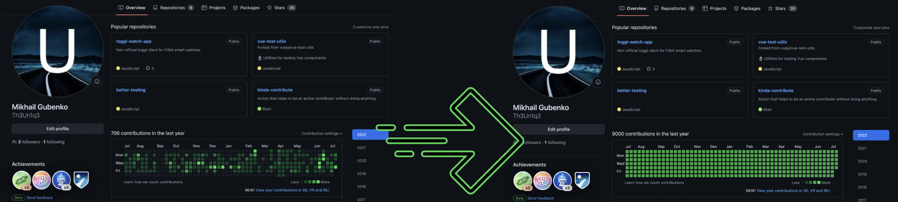
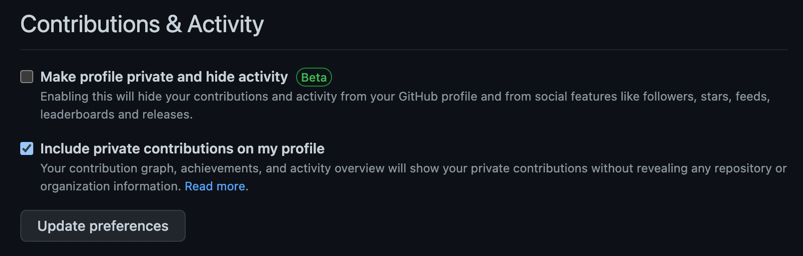

# Contribute. 🧑‍💻 Kinda... 🤷‍

Action that helps to appear actively contributing without doing anything. 



[](https://github.com/Th3Un1q3/kinda-contribute/actions/workflows/test-contribute.yml)
[](https://github.com/Th3Un1q3/kinda-contribute/actions/workflows/scheduled-contribute.yml)

# Usage

```yaml
name: Schedule contributions generation
on:
  schedule:
    # Desired contribution schedule
    # [More about scheduled running](https://docs.github.com/en/actions/using-workflows/events-that-trigger-workflows#schedule)
    - cron: '0 15 * * 1-5' # At 15:00 on every day-of-week from Monday through Friday.

jobs:
  run:
    name: Populate Contributions
    runs-on: ubuntu-latest
    steps:
      - uses: actions/checkout@v3
        with:
          # Target Branch to commit to
          # Only commits to the default branch are considered as contributions.
          # OPTIONAL: for scheduled actions default branch is used,
          # so do not specify it without need.
          ref: usage
          # It's required to use your personal access token
          # in order to make it look like it's your activity.
          # The token must be enabled for the private repo scopes.
          # [Action Docs](https://github.com/actions/checkout#usage)
          token: ${{ secrets.PERSONAL_ACCESS_TOKEN }}

      - uses: 'Th3Un1q3/kinda-contribute@main'
        with:
          # Defines range from 1 to 5(in this case) of commits to make
          # Optional, default is 5
          max-commits: 5


          # Defines exact number of commits to make, useful when you
          # want to make a specific number of commits or use your own random number generator.
          # This will override max-commits.
          # Optional
          exact-commits: 3


          # By default action will push to the target branch.
          # If you need to ignore push, set this to false.
          # Optional, default is true
          include-push: true
```

### Examples

You can find more examples in `.github/workflows`.

### Keep your contribution private but activity visible

* Create any private repo you want.
* Configure your profile to Include private contributions on [your profile](https://github.com/settings/profile)
* * 
* Make sure you have a personal access token enabled for the private repo scopes.
* Apply your personal access token during [checkout](https://github.com/actions/checkout#usage) action.
